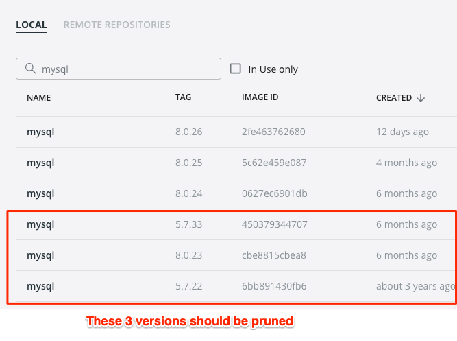
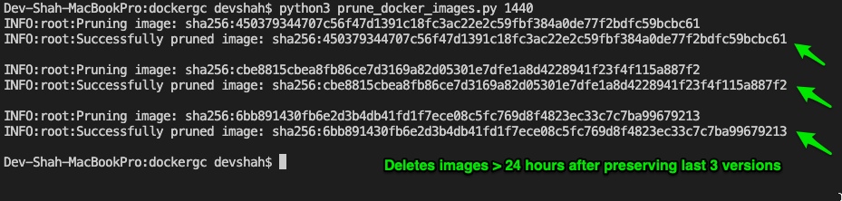

# Docker Garbage Collection

This application will prune local docker image versions based on the following conditions & assumptions given below:

## Conditions

1. The image version should be older than the given threshold in minutes **AND**
2. The image version shouldn't be one of the latest 3 versions as we want to preserve history

## Assumptions

1. Application doesn't prune a single image that has `n` tags, because technically it's pointing to 1 version & we want to keep last 3 versions

2. Application doesn't prune an image version that has dependent child images
   - **Example #1** - Docker API will throw an exception if we try to prune an eligible `python:3` image which is being used my another image called `mypythonapp`
   - **Example #2** - Docker API will throw an exception if we try to prune an eligible untagged intermediate image i.e. `<none:<none>` where some of it's layers are being used by a new version of that image

3. Application doesn't prune an image that is currently in use.

4. Application is not using `prune()` method for removing images because it only accepts a filter as argument. Since we are creating a custom filter, `remove()` method is a better choice.

## How to run

#### Step 1: Clone the repo to your local
```
git clone https://github.com/devsh4/dockergc.git
```
#### Step 2: Go to the directory
```
`cd dockergc/`
```

#### Step 3: Install dependencies

```
python3 -m pip install -r requirements.txt
```
#### Step 4: Run the application with custom threshold in minutes (optional) -

```
python3 prune_docker_images.py 1440
```

*Note: If `minutes` argument isn't passed, the default is 1440 minutes i.e. 24 hours.*

## Results

Here is an example of how the application works for a bunch of `mysql` images where `TIMEOUT_IN_MINUTES=1440 (24 hours)` -



Execution Logs:

